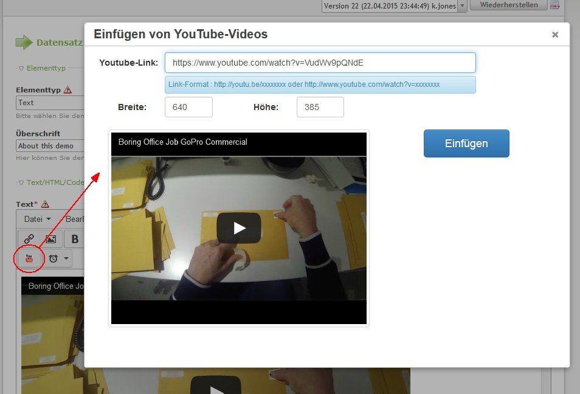

Contao Extension: TinyMceYouTube
================================

Special TinyMCE plugin to add videos from YouTube into the editor via button.

The sources of this plugin could be found [here](https://github.com/gtraxx/tinymce-plugin-youtube).

Now for TinyMCE 4.

Installation
------------

Install the extension via composer: [cliffparnitzky/tiny-mce-you-tube](https://packagist.org/packages/cliffparnitzky/tiny-mce-you-tube).

If you prefer to install it manually, download the latest release here: https://github.com/cliffparnitzky/TinyMceYouTube/releases

Tracker
-------

https://github.com/cliffparnitzky/TinyMceYouTube/issues

Compatibility
-------------

- Contao version >= 4.4.0

Dependency
----------

- To load this plugin and add it to the configuration the extension [[TinyMcePluginLoader]](https://github.com/cliffparnitzky/TinyMcePluginLoader) has to be installed.

Screenshot
----------

Additional information
----------------------

### Special notes

It's necessary to add `<iframe>` to the list of **Allowed HTML tags** (see Settings => Security Settings).

### Information in the wiki

#### Create a new ...

* [Creating a new plugin](https://github.com/cliffparnitzky/TinyMcePluginLoader/wiki/Creating-a-new-plugin)
* [Creating a new bundle](https://github.com/cliffparnitzky/TinyMcePluginLoader/wiki/Creating-a-new-bundle)
* [Creating a new setup](https://github.com/cliffparnitzky/TinyMcePluginLoader/wiki/Creating-a-new-setup)

#### Installation hints
* [Install manually](https://github.com/cliffparnitzky/TinyMcePluginLoader/wiki/Install-manually)

#### Bug report hints

* [Report a bug](https://github.com/cliffparnitzky/TinyMcePluginLoader/wiki/Report-a-bug)